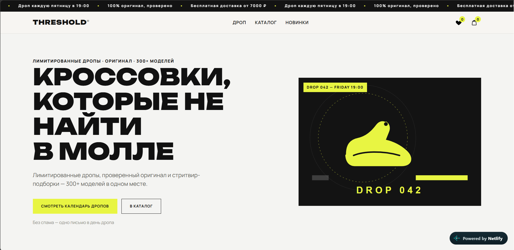
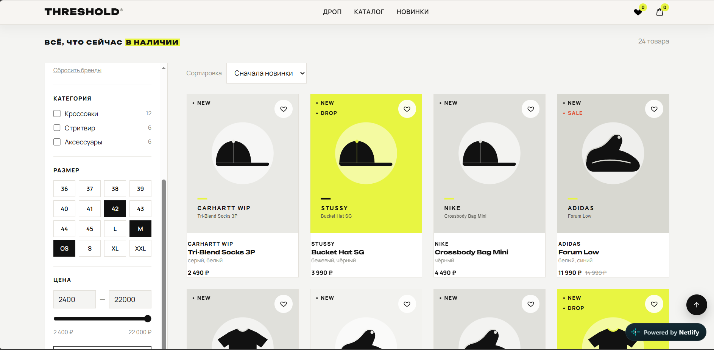
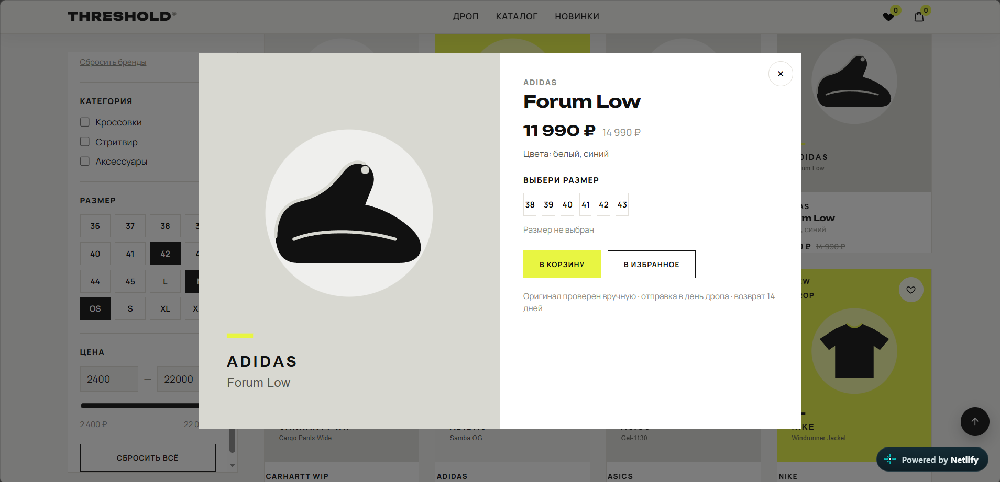
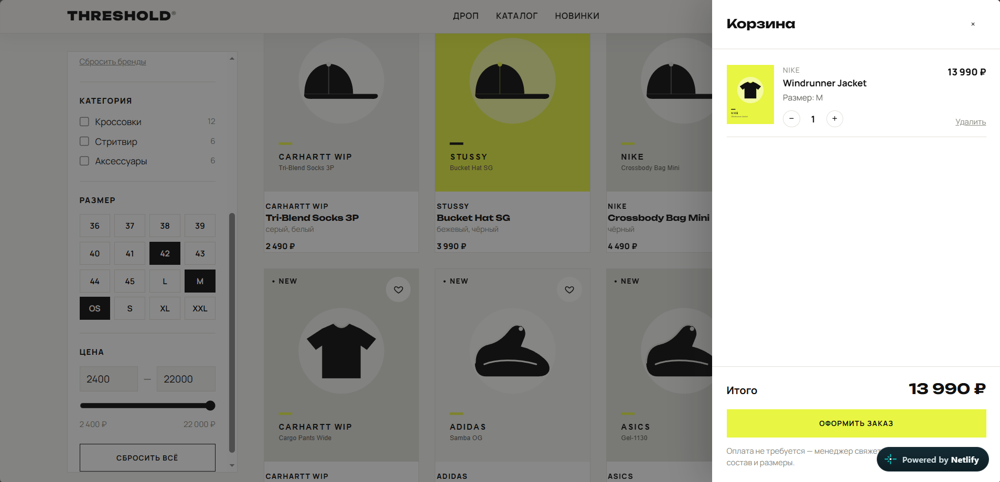
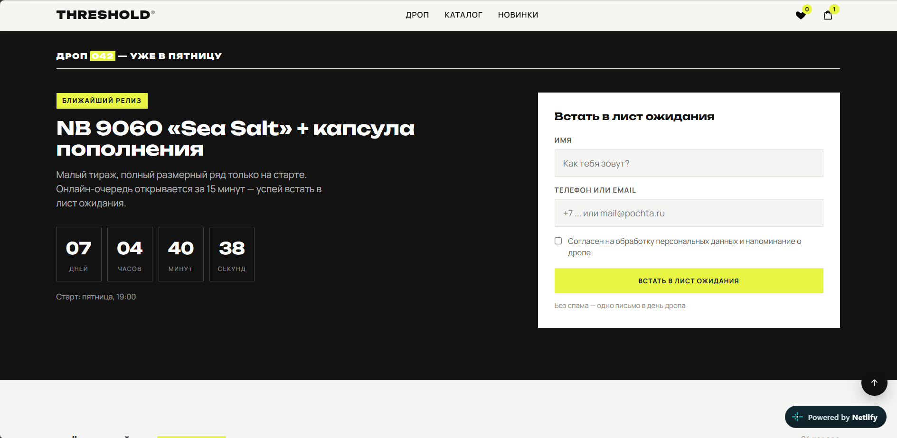

# THRESHOLD — витрина магазина лимитированных кроссовок с механикой дропов.

## Проблема
Раньше магазин сталкивался с тем, что не успевал оперативно обрабатывать наплыв покупателей во время дропов лимитированных моделей. Из-за медленной обработки заказов и отсутствия интерактивного информирования клиенты уходили к конкурентам, а популярные релизы распродавались без прозрачной очереди.

## Решение
Разработана современная интерактивная витрина **THRESHOLD**, включающая:
- Каталог с продвинутыми фильтрами (бренд, категория, размер, цена) и мгновенным поиском.
- Подробные карточки товаров с выбором размеров и добавлением в избранное/корзину.
- Корзину на базе `localStorage` с сохранением выбранных позиций.
- Интерактивный таймер дропа с формой листа ожидания и уведомлением клиентов.
- Удобные интерактивные формы заявок.

## Функции и стек
- **Frontend:** чистый HTML5, CSS3 (современный дизайн, анимации, адаптивная верстка) и Vanilla JavaScript без использования тяжелых фреймворков.
- **Данные:** каталог товаров динамически загружается из `products.json`.
- **Хранение:** `localStorage` для корзины и состояния пользователей.
- **Деплой и хостинг:** Netlify.

## Как запустить локально
1. Скачайте или клонируйте репозиторий:
   ```bash
   git clone https://github.com/Evgenij800/threshold.git
   cd threshold
   ```
2. Откройте файл `index.html` в любом современном браузере.
   *Или поднимите локальный сервер* (например, через VS Code Live Server или Python):
   ```bash
   python -m http.server 8000
   ```
   И перейдите в браузере по адресу `http://localhost:8000`.

## Живой сайт
[https://threshold.neofreelance.ru](https://threshold.neofreelance.ru)

## Скриншоты

| Скриншот | Описание |
| :--- | :--- |
|  | **Главный экран (Hero):** анонс ближайшего дропа, ключевые преимущества магазина и быстрый переход к каталогу. |
|  | **Каталог:** сетка товаров в наличии с фильтрами по брендам, категориям, размерам и диапазону цен. |
|  | **Карточка товара:** детальный просмотр модели, выбор размера и добавление в корзину или избранное. |
|  | **Корзина:** модальное окно с выбранными кроссовками, расчетом итоговой суммы и оформлением заказа. |
|  | **Дроп и лист ожидания:** блок обратного отсчета времени до релиза и форма подписки на уведомления. |
